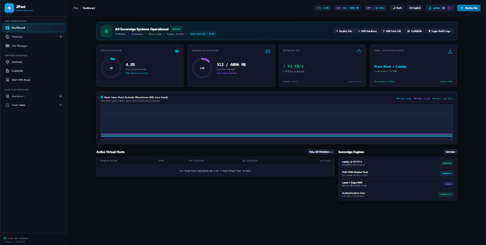
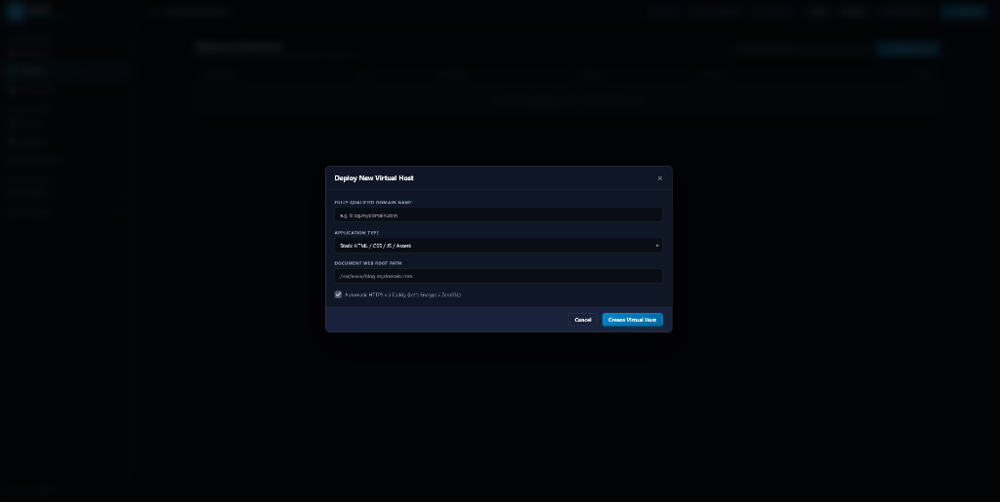

# ZPanl ⚡🌐

> **Sovereign, Ultra-Lightweight Linux Web Control Panel for Static Websites & PHP-FPM.**  
> Built in Pure Rust as part of the [`ZeroUniverse`](https://github.com/kzxl/ZeroUniverse) ecosystem.

[](LICENSE)
[]()
[]()

---



---

## 🌟 Overview

**ZPanl** is a sovereign alternative to heavy, monolithic hosting panels (aaPanel, cPanel, Plesk) engineered specifically for **static websites, modern SPAs, reverse proxies, and dynamic PHP-FPM applications**.

Where traditional panels consume 500 MB – 1 GB of RAM running Python/Node/PHP daemon stacks, **ZPanl** compiles into a **single, self-contained binary (< 5 MB)** that consumes **under 10 MB of RAM** while providing:

- 📊 **Zero-Alloc Linux Telemetry**: Real-time CPU, RAM, and Network traffic parsed directly from `/proc/stat`, `/proc/meminfo`, and `/proc/net/dev`.
- 📈 **60s Real-Time Activity Waveform**: Hardware-accelerated HTML5 `<canvas>` 2D live telemetry chart tracking rolling CPU, Memory, and Network bandwidth curves with zero external dependencies.
- 🌐 **Automated Caddy v2 Integration**: Automatic Let's Encrypt / ZeroSSL HTTPS, HTTP/3, and reverse proxy routing without manual config editing.
- 🛡️ **Layer-7 Edge WAF & Security Gate**: Heuristic bot blocking (ByteSpider, PetalBot, Semrush), SQLi/XSS filtering, IP blacklists, and salted SHA-256 key-stretched brute-force lockouts.
- 🐘 **Multi-Version PHP-FPM Engine**: Isolated on-demand worker pools (`pm = ondemand`) for PHP 8.1, 8.2, and 8.3 via fast Unix domain sockets.
- 📁 **Jailed Web File Manager**: Drag-and-drop file/folder uploads, Path Traversal jail sandbox (`../../etc/passwd` rejection), and atomic file staging (`.tmp` + rename).
- 🗄️ **Database & Scheduled Crontab**: Relational database management with 1-click `.SQL` backup downloads and automated cron execution schedules.
- 🚀 **Zero-Downtime Git-Ops**: Atomic symlink releases (`releases/` & `current`) with automated GitHub/GitLab webhook triggers.
- 🌓 **Dual Theme Engine (Dark / Light)**: 1-click theme switching between high-tech Dark Mode and clean Light Mode, persisted in local storage.
- 🇻🇳 🇬🇧 **Full Multilingual I18N**: Seamless live switching between English and Vietnamese.
- 🖥️ **Embedded Sovereign Single-Binary UI**: Fast, responsive SPA embedded directly inside the binary via `include_str!` (`0` external CDN or runtime dependencies).

---

## 📸 UI Showcase & Screenshots

### High-Tech Real-Time Dashboard
Modern sovereign control center featuring rolling 60-second host telemetry waveforms, core radial utilization dials, health status indicator, active virtual hosts table, and engine daemon matrix:


### Virtual Host Provisioning Modal
Instant 1-click deployment modal supporting Static sites, Single-Page Applications (SPA fallback), Reverse Proxies, and PHP-FPM worker runtimes with automatic SSL certificates:



---

## 🏛️ Architecture

```
┌────────────────────────────────────────────────────────────────────────┐
│                          Browser Client                                │
│       Embedded Modern High-Tech SPA (HTML5 / CSS / Canvas / JS)        │
└───────────────────────────────────▲────────────────────────────────────┘
                                    │ HTTP/1.1 REST & Embedded Assets
                                    ▼
┌────────────────────────────────────────────────────────────────────────┐
│                         ZPanl Daemon (`zpanl`)                         │
├───────────────────────────────────┬────────────────────────────────────┤
│           zero-sys                │              zero-caddy            │
│ • Zero-alloc `/proc` Telemetry    │ • Caddyfile & JSON Route Builders  │
│ • Systemd Service Actions         │ • Admin API Dynamic Reload         │
├───────────────────────────────────┼────────────────────────────────────┤
│         zero-fastcgi              │              zero-vfs              │
│ • FastCGI v1.0 Binary Framing     │ • Directory Traversal Jail Sandbox │
│ • PHP-FPM Worker Pool INI Engine  │ • Atomic Staging File Replacement  │
└─────────────────┬─────────────────┴──────────────────┬─────────────────┘
                  │                                    │
                  ▼                                    ▼
     ┌────────────────────────┐           ┌────────────────────────┐
     │   Caddy v2 Web Server  │           │   PHP-FPM Process Pool │
     │  Automatic HTTPS / QUIC│           │   php8.1 / 8.2 / 8.3   │
     └────────────────────────┘           └────────────────────────┘
```

---

## 🚀 Quick Start

### 1. Build and Run

```bash
# Clone and build
git clone https://github.com/kzxl/ZeroUniverse.git
cd ZeroUniverse/ZeroApps/ZPanl
cargo build --release

# Run panel daemon (default http://0.0.0.0:8888)
./target/release/zpanl run --bind 0.0.0.0:8888
```

Open your browser and navigate to `http://<server-ip>:8888`.

### 2. Command Line Interface (CLI)

```bash
# View real-time Linux telemetry
zpanl telemetry

# Inspect status of Caddy and PHP-FPM
zpanl services

# Create a virtual host
zpanl site add blog.example.com /var/www/blog.example.com php 8.2
zpanl site add app.example.com /var/www/app.example.com spa

# List registered sites
zpanl site list

# Export synchronized Caddyfile
zpanl export-caddy > /etc/caddy/Caddyfile
```

---

## 🐧 Systemd Daemon Setup (`zpanld.service`)

Create `/etc/systemd/system/zpanld.service`:

```ini
[Unit]
Description=ZPanl Sovereign Web Control Panel
After=network.target caddy.service

[Service]
Type=simple
User=root
WorkingDirectory=/etc/zpanl
ExecStart=/usr/local/bin/zpanl run --bind 0.0.0.0:8888 --db /etc/zpanl/sites.json
Restart=always
RestartSec=3

[Install]
WantedBy=multi-user.target
```

Enable and start:
```bash
sudo systemctl daemon-reload
sudo systemctl enable --now zpanld
```

---

## 📜 License

Licensed under the [MIT License](LICENSE).
